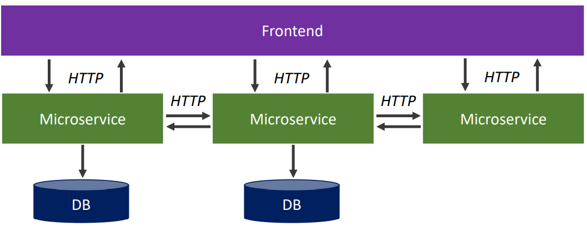
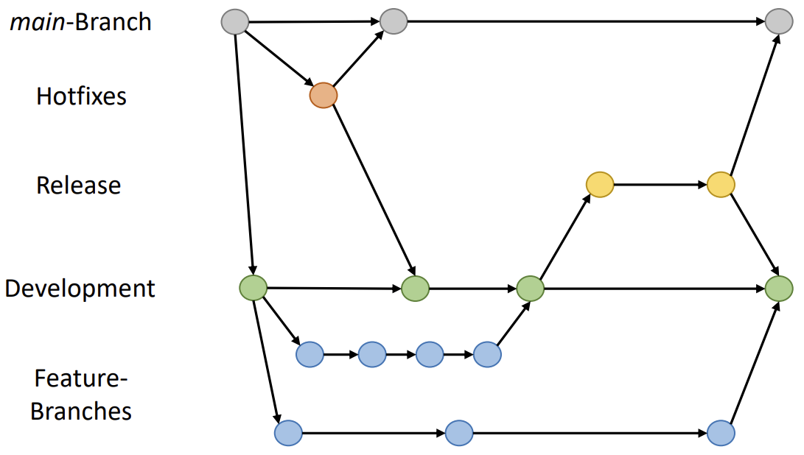

MPP2 - Themenkatalog
====================

<!-- md2apkg ignore-card -->

<!-- START doctoc generated TOC please keep comment here to allow auto update -->
<!-- DON'T EDIT THIS SECTION, INSTEAD RE-RUN doctoc TO UPDATE -->

<!-- END doctoc generated TOC please keep comment here to allow auto update -->

<!--pagebreak-->

# Präambel

Diese File beinhaltet überwiegend Inhalte der letzten beiden Semester zur Vorbereitungen für die zweite mündlichen Praxisprüfung. Es sollte stets gemeinsam mit den [Vorbereitungen zur ersten Praxisprüfung](../BASE-PACK/README.md) betrachtet werden.

Als größtenteil irrelevant betrachtete Themen:
> **ToDo**
>
> - manche WPM II und III
>   - Herbst Unity
>   - Medienkram Turtenwald
>   - **ToDO**
> - Graphische Datenverarbeitung - (GDV) - Herbst
> <!--über die folgenden müssen wir noch diskutieren-->
> - neuronale Netze und maschinelles Lernen - (ML) - Feldmann (**ToDo**)
> - Forensik - (PRO) - Strassburg (**ToDo**)
> - e-Commerce - (WEB) - Müller (**ToDo**)
> - Consulting - (CONS) - Müller (**ToDo**)
> - ABWL 1&2 - Leder (Ausnahmen)

<!-- md2apkg ignore-card -->

# Hardwarenahe Programmierung

## Application Binary Interface (ABI)

- **Binärschnittstelle** zur Verarbeitung von Befehlen auf Maschinenebenen
- legt u.a. **Aufrufkonventionen** fest
- reserviert benötigte Prozessorregister
- muss auf eine Architektur festgelegt sein

## Register

> Speicherbereich innerhalb eines Prozessors

- **Datenregister:** Speicherung von Operanden und Ergebnisse
- **Adressregister:** Adressierung von Operanden (Speichern von Adressen)
- **Steuerregister**

## Stack(-Speicher)

- vgl. Datenstruktur (Stapel-/Kellerspeicher $\rightarrow$ **LIFO**)
- beinhaltet **Parameter und lokale Variablen**
- in Mikroprozessoren: **Register des Stackpointer**
- bei Aufruf eines Unterprogramms: **Rücksprungadresse ablegen**
- beginnt i.d.R. bei hoher Adresse, wächst Richtung 0 "nach unten"
- bei **Multitasking-Systemen** besitzt **jeder Thread eine eigenen Stack**

## Heap(-Speicher)

- dynamischer Speicherbereich
- kann nur Laufzeit beliebig angefordert werden
- vgl. `malloc()`/`free()` in `C`
- im Gegensatz zu Stack deutlich größer

## AVR ATmega 8515L

### Flags

- Statusregister `SREG` enthält **1-Bit-Informationen** (Flags)
- zeigen **Zustände** an `Carry`, `Zero`, `Negative`, `Overflow`
- Grundlage für **bedingte Sprünge**
- Auch zum **(De-)aktivieren** von Funktionen (`Interrupt`-Flag)

### Timer

- **Interrupt-Quelle** im Zusammenhang mit Microcontroller-Takt
- meist Teilung des Takt durch **Prescaler**

**Anwendungen**

- Zeitgeber (periodische Interrupts)
- Zeitverzögerungen (Ersatz für Programmschleifen)
- Frequenzgenerator/-messer

### Watchdog

- Zähler mit eigenem Takt
- Erreichen eines **Schwellwert** führt zu Neustart
- Ziel: **Reset** des Programms im Fehlerfall (Endlosschleifen)
- wird im Normalbetrieb regelmäßig zurückgesetzt

### Interrupt

> **kurzfristige Unterbrechung** eines Programms durch eine von der CPU abzuarbeitende Befehlssequenz (Interrupt Service Routine $\rightarrow$ schnelle Reaktion auf I/O, Zeitgeber, ...)

#### Ablauf eines Interrupt

- Sperren weiterer Unterbrechungen mit gleicher oder geringerer Priorität
- Sicherung wichtiger Register-Informationen
- Bestimmen der Interruptquelle (durch Hardware realisiert)
- Laden des zugehörigen Interruptvektors
- Abarbeitung der Interruptroutine
- Rückkehr zur unterbrochenen Aufgabe (Registerinformationen wiederherstellen)

# Systemprogrammierung

## Parallele Programmierung

> gleichzeitige Abarbeitung von Aufgaben

- Motivation: **Zeit sparen** $\rightarrow$ eine große Aufgabe wird zur selben Zeit in mehreren kleinen erledigt
- **Ausnutzung der Hardware:** Multicore-Prozessoren, verteilte Rechnerkerne

## Atomare Operation

- Verbund von Einzeloperationen, der als logische Einheit betrachtet wird
- kann nur als Ganzes erfolgreich ablaufen oder fehlschlagen
- nicht durch andere Operationen unterbrechbar

## Exklusive Ressourcen

- Betriebsmittel, die zu jeden Zeitpunkt nur von genau einem Prozess genutzt werden können

## Prozesssynchronisation

> Koordinierung des zeitlichen Ablaufs mehrerer nebenläufiger Prozesse

## Race Condition

> Konstellation, in der das Ergebnis einer Operation vom zeitlichen Verhalten bestimmter Einzeloperationen oder der Umgebung abhängt

## Deadlock

- **Allgemein:** Situation, in der sich beide Alternativen eines Dilemmas gegenseitig blockieren
- **Informatik:** zyklische **Wartesituation** zwischen mehreren Prozessen, wobei jeder beteiligte Prozess auf die **Freigabe von Betriebsmitteln** wartet, die bereits ein **anderer beteiligter Prozess exklusiv belegt** hat

### Philosophenproblem

- **5 Philosophen** mit **5 Stäbchen** an rundem Tisch
- Aktion: Denken oder Essen
- Essen benötigt zwei Stäbchen
- wenn nur ein Stäbchen verfügbar ist, wird dieses so lange reserviert, bis auch das zweite verfügbar ist.

> gleichzeitiger Zugriff $\rightarrow$ Deadlock

### Vermeidung von Deadlocks

> eine der notwendigen Bedingungen eliminieren

- **Exklusive Ressourcen:** Verwaltung durch Spooler
- **Belegungs- und Wartebedingung:** alle benötigten Ressourcen im vorraus anfordert und nur dann ausführen, wenn alle verfügbar
- **Ununterbrechbarkeit:** Prozessen Ressourcen entziehen (oft schwierig/unmöglich $\rightarrow$ Drucker)
- **Zyklische Wartebedingung:** Ressourcen durchnummerieren und nur in aufsteigender Reihenfolge reservieren

#### "Hartes" Beenden eines Deadlock-Zustandes

- Prozess beenden, Signal `SIGTERM`/`SIGKILL`
- Reboot

## fork()

- erzeugt exakte Kopie des Aufrufers als Kindprozess
- Kindprozess übernimmt Code, Daten inkl. Befehlszähler, Dateideskriptoren, ...

### Rückgabewerte von fork()

- `>0`: die PID des Kindprozesses
- `0`: es wurde eben geforkt und wir sind das Kind
- `-1`: Fehler

## Semaphore

- Variable, die die **Verwaltung beschränkter (zählbarer) Ressourcen** ermöglicht
- Manipulation der Semaphore über zwei **unteilbare Operationen** (reservieren = `P(sema)`; freigeben = `V(sema)`)
- **Synchronisation** von Prozessen $\rightarrow$ Semaphore **realisiert ein passives Warten der Prozesse**

## Kritische Abschnitt

> mehreren Einzelanweisungen, deren Zwischenergebnisse inkonsistente Zustände darstellen

- zu jedem Zeitpunkt darf sich nur ein einziger Prozess in diesem Abschnitt aufhalten (Sicherstellung der Konsistenz, Deadlocks)
- Entwickler definieren einen kritischen Abschnitt

## Interprozesskommunikation

> Informationsaustausch zwischen mehreren Prozessen

- Mittel: Pipes, Sockets, Shared Memory
- Ziel: Verhinderung von...
  - gleichzeitigen Schreibzugriffen
  - Verhungern von Prozessen
  - Deadlocks

### Pipes

- **unidirektionaler Datenstrom zwischen zwei Prozessen**
- vgl. Puffer/Warteschlange nach dem **FIFO**-Prinzip

#### Pipes: Arten

- **namenlose Pipes:** Kommunikation zwischen Prozessen mit gemeinsamen Vorfahren (`fork()`)
- **benannte Pipes:** Zugriff durch alle Prozesse mit Zugriffsrecht möglich

#### Pipes: Operationen

- `write(pipefd[1],buffer)`
  - Write: aus **Programmbuffer auf die Pipe schreiben** (in den Kernelbuffer)
  - Daten sind **gepuffert bis sie gelesen werden**
- `read(pipefd[0],buffer)`
  - Read: aus **Kernelbuffer in Programmbuffer schreiben** ("Pipe lesen")
  - Lesen verbraucht Daten der Pipe (vgl. Warteschlange)

### Socket

#### Socket: Addressfamilien

- `AF_UNIX`: Unix-Domain
- `AF_INET`: Internet-Domain (bzw. `AF_INET6`)
- diverse andere, viele veraltet
  - `AF_IRDA`
  - `AF_BLUETOOTH`

#### Socket: Arten

- `SOCK_DGRAM`: verbindungslos (vgl. `UDP`)
- `SOCK_STREAM`: verbindungsorientiert (vgl. `TCP`)

außerdem

- `SOCK_RAW`: nur für Developer, Root-User, Zugriff auf L3,L2-Felder $\rightarrow$ eigenes L4-Protokoll entwickeln

### Pipe vs. Socket

| Pipes                                                                 | Sockets               |
| --------------------------------------------------------------------- | --------------------- |
| - unidirektional                                                      | - bidirektional       |
| - Unix-Domaine (nur gleiches Rechensystem)                            | - Unix/Internetdomäne |
| - Kommunikationspartner benötigen gemeinsamen Elternprozess (unnamed) |                       |

### Shared Memory

- **geteilter Speicherbereich** zwischen mehreren Prozessen
- Kommunikation über Shared Memory erfordert **Prozesssynchronisation**

### bidirektionale Interprozesskommunikation

- zwei Pipes (für jede Richtung eine)
- Sockets
- Shared Memory

# Entwicklung von Webanwendungen

## Client-Technologien

- `HTML 5` $\rightarrow$ Beschreibung der Struktur der Webseiten
- `CSS 3` $\rightarrow$ Formatierung / Aussehen
- `Java-/ECMA-Script` $\rightarrow$ Interaktion
- `DOM/Ajax` $\rightarrow$ Manipulation des Seiteninhalts
- `JSON`, `XML`(`SVG`, `MathML`, `RSS`, `GraphML`, ...) $\rightarrow$ Datenaustausch

## Server-Technologien

- `PHP`
- `Java`
- `NodeJS`
- `Ruby` *(on Rails)*
- `ASP.NET`

## HTML

### HTML-Sytnax: Tags

- Auszeichnung von Elementen durch Tags
- `<tag>Text</tag>`
- schließende Tags können in einigen Fällen entfallen (z.B. ``)
- Tags können **Attribute** enthalten `<tag attribut="Wert">body</tag>`
- Tags können **hierarchisch** geschachtelt werden

### HTML-Struktur: `<html>`

- `<html>` ist sogenanntes Wurzeltag
- Attribut `lang` gibt die Dokumentensprache an

### HTML-Struktur: `<head>`

- **Dateikopf**, **Meta**informationen, **keine Darstellungen**
- Informationen werden durch **Browser**, **Suchmaschinen** und **Crawler** benutzt

### HTML-Struktur: `<body>`

- Hauptteil der Seite
- Inhalt (angezeigte Elemente)

### HTML 5: Verbesserungen

- Schwerpunkt auf **semantischer Gliederung** der Seite
- bessere **automatisierte Auswertung** der Inhalte durch **Suchmaschinen**
- Screenreader können flüssiger lesen
- weitere Neuerungen für Multimedia, Formulare

#### HTML 5: Gliederungselemente

- `<header>`
- `<nav>`
- `<main>`
- `<article>`
- `<section>`
- `<footer>`
- `<aside>`
- ...

### HTML Universalattribute

- `id`: eineindeutig
- `class`: kann mehrmals vergeben werden
- `hidden`: Element ausblenden
- `lang`: Sprache für Elemente überschreiben
- `style`: inline CSS-Attribute

## CSS

### CSS in HTML einbinden

- `<style>`-Tag in `head`/`body` im HTML
- inline für einzelne Elemente (`style="..."`)
- externe CSS-Datei (`<link rel="stylesheet" type="text/css" href="style.css">`)

### Box-Model

> alle HTML-Elemente werden von Boxen umgeben (innen nach außen)

- **Content:** Tatsächliche Größe des Inhalts (Bild/Text/...)
- **Padding:** Puffer zwischen Content und Border, transparent
- **Border:** Abgrenzung um das Padding (Linie mit eigener Breite, Farbe)
- **Margin:** Abstand zu anderen Elementen (transparent)


### Selektoren

- Typselektor (HTML-Element)
- Universalselektor (`*`)
- Klassenselektor (beginnt mit `.`)
- ID-Selektor (beginnt mit `#`)
- Attributselektor `[Attributname]`
- Pseudoklassen (beziehen sich auf Eigenschaften der HTML-Elemente)
- Pseudoelemente (beginnen mit `::`) z.B. `p :: before {content: ´+´}`
- Verbundsselektoren (*.classname) bezieht sich auf Hierachie, benachbarte Elemente

## Javascript

### Anwendungen

- clientseitige Datenvalidierung
- Dialogfenster
- Nachladen von Daten ohne Reload der Seite
- Autovervollständigung/Suchvorschläge
- Manipulation von Websites per DOM

### JS in HTML einbinden

- `<script>`-Tag in `head`/`body` im HTML
- inline in bestimmten Tags (z.B. `onclick`)
- externe JS-Datei `<script src="müll.js">`

**Weitere Umgebungen**

- Entwicklerkonsole des Browsers
- Ausführung auch unabhängig vom Browser mit `Node` $\rightarrow$ `JS` auch für Serveranwendungen

### Unterschied JavaScript & ECMA-Script

- `ECMA-Script` $\rightarrow$ Scripting Language Specification
- `JavaScript` (& andere Scriptsprachen) $\rightarrow$ setzen diesen Standard um

### DOM

> Document Object Model

- **Programmierschnittstelle** für HTML- (und XML-Dokumente)
- stellt HTML-Elemente als **Baumstruktur** dar
  - jeder Knoten ist ein Element (Textabschnitte, Überschriften, Tabellen)
  - **hierarchischer Aufbau** (Eltern- und Kindknoten)
- ermöglicht **Zugriff und Manipulation von Elementen**

## PHP

> Skriptsptache zur Erstellung dynamischer Webseiten

**Anwendungsbereiche**

- Backend (Datenverarbeitung)
- Datenbankzugriff
- Sessionverwaltung
- Autorisierung

# IT-Sicherheit/-Recht/-Infrastrukturen

## Schutzziele

- Verfügbarkeit
- Vertraulichkeit
- Integrität

erweitert:

- Verbindlichkeit
- Authentizität
- Zurechenbarkeit

## IT-Grundschutz-Kompendium

> beinhaltet Einführung in die IT-Grundschutz-Methodik, Modellierung, Bausteine, Elementare Gefährdungen

- **Prozess-Bausteine:** `ISMS` (Sicherheitsmanagement), `ORP` (Organisation und Personal), `CON` (Konzeption und Vorgehensweise), `OPS` (Betrieb), `DER` (Detektion und Reaktion)
- **System-Bausteine:** `APP` (Anwendungen), `SYS` (IT-Systeme), `IND` (Industrielle IT), `NET` (Netze und Kommunikation), `INF` (Infrastruktur)

## Governance vs. Compliance

- **Governance:** Einhaltung von Richtlinien wird **empfohlen**
- **Compliance:** Einhaltung von Richtlinien ist **verpflichtend**

## Geltende Gesetze

- DSGVO
- Telemediengesetz
- E-Government-Gesetz
- klassisches IT-Recht besitzt nur vereinzelt besondere Gesetze ($\uparrow$)
- relevante Normen größtenteils über viele verschiedene Rechtsquellen verteilt
- u.a.: Zivil- und Urheberrechts; kartell- und strafrechtliche Regelungen; Normen aus AWG, DSGVO, Dual-Use VO, GeschGehG, HGB, InsO, KWG, ...

## DSGVO

### Personenbezogene Daten

> alle Informationen, die sich auf eine identifizierte oder identifizierbare lebende Person beziehen.

### Besondere Datenkategorien (Art. 9)

- Gesundheits- und biometrische Daten
- Politische Meinungen
- Religion
- Ethnie
- Gewerkschaftsangehörigkeit

> Diese sensiblen Daten besitzen einen **hohen Schutzbedarf** und benötigen **besondere technisch-organisatorische Maßnahmen**

### Grundsätze der Verarbeitung (Art. 5)

- Verarbeitung muss **rechtmäßig** und **zweckgebunden** erfolgen
- **Datenminimum**
- **Richtigkeit** der Daten
- **Integrität** und **Sicherheit** mit TOMs
- **Rechenschaftspflicht** (Verarbeitungsübersicht, SiKo)

## BSI-Standards des IT-Grundschutz (200-x)

- `BSI-Standard 200-1`: Aufbau eines Informationssicherheitsmanagementsystems
- `BSI-Standard 200-2`: Vorgehensweisen nach IT-Grundschutz
- `BSI-Standard 200-3`: Risikoanalyse
- `BSI-Standard 200-4`: Business Continuity Management

### `BSI-Standard 200-1`: Managementsysteme für Informationssicherheit

- Was: Erfolgsfaktoren beim Management von Informationssicherheit
- Wie: Steuerung und Überwachung des Sicherheitsprozesses vom verantwortlichen Management
- Wie: Entwicklung von Sicherheitszielen und angemessener Sicherheitsstrategie
- Wie: Auswahl Sicherheitsmaßnahmen und Erstellung Sicherheitskonzepte
- Wie: Erhalten und Verbessern eines erreichten Sicherheitsniveaus

- kontinuierlicher Verbesserungsprozess (PDCA)

### `BSI-Standard 200-2`: Vorgehensweisen nach IT-Grundschutz

- Anleitungen zu:
  - Aufgaben des IT-Sicherheitsmanagements
  - Etablierung einer IT-Sicherheitsorganisation
  - Erstellung eines IT-Sicherheitskonzepts
  - Auswahl angemessener IT-Sicherheitsmaßnahmen
  - IT-Sicherheit aufrecht erhalten und verbessern
- Basis-, Kern- oder Standard-Absicherung
- Standard-Absicherung ermöglicht ISO 27001 Zertifizierung

#### Standard-Absicherung

1. Strukturanalyse
2. Schutzbedarfsfeststellung
3. Modellierung
4. IT-GS-Check
5. ggf. Risikoanalyse
6. Konsolidierung
7. IT-GS-Check
8. Realisierung der Maßnahmen

> immer währenddessen: Aufrechterhaltung und kontinuierliche Verbesserung

## Anonymisierung vs. Pseudonymisierung

- **Anonymisierung:** **Verändern personenbezogener Daten** derart, dass diese Daten nicht mehr oder nur mit einem unverhältnismäßig großen Aufwand (Zeit/Kosten) einer bestimmten oder bestimmbaren natürlichen Person zugeordnet werden können
- **Pseudonymisierung:** **Ersetzen von Identifikationsmerkmal** durch Pseudonym sodass eine Festellung der Identität des Betroffenen ausgeschlossen werden kann

> bei der Pseudonymisierung können Bezüge verschiedener Datensätze erhalten bleiben

# Rechnernetze und Verteilte Systeme

> **ToDo**
>
> - Verteiltes System (Definition) [DONE]
> - CAP-Theorem [DONE]
> - Namens- und Verzeichnisdienste [DONE]
> - Caching vs. Replikation [DONE]
> - ACID vs. BASE [DONE]
> - sync. vs. async (Replikation)
> - Microservices
> - Firewalls
> - VLAN
> - OSPF
> - BGP
> - Architekturen
> - REST-API

<!-- md2apkg ignore-card -->

## Verteiltes System (Definition)

Ein verteiltes System...

- besteht aus **mehreren Einzelkomponenten** auf **unterschiedlichen Rechnern**
- besitzt **keinen gemeinsamen Speicher**
- koordiniert und kooperiert mittels **Nachrichtenaustausch** (Netzwerk)
- hat ein **gemeinsames Ziel**
- tritt gegenüber Nutzenden als **kohärentes System** auf

## CAP-Theorem

Ein verteiltes System kann zwei der folgenden Eigenschaften gleichzeitig erfüllen, jedoch nicht alle drei:

- **C**onsistency (Konsistenz)
- **A**vailability (Verfügbarkeit)
- **P**artition Tolerance (Ausfalltoleranz)

## Namens- vs. Verzeichnisdienste (Definition)

- **Namensdienst:** Bilden Namen auf Adressen ab
  - Namen: standortunabhängige Bezeichnung einer Ressource
  - Adresse / Referenz: eindeutige, physikalische / ortsbezogene Bezeichnung
- **Verzeichnisdienst:** Finden von Kommunikationspartnern, Ressourcen, Attributen, ...
  - Erweiterung des Namensdienstes

### Caching vs. Replikation

**Caching**

- Speicherung von Teilen des Namensraums
- v.a. auf unteren Ebenen
- vollst. oder teilw. Namen
- *reaktiv*

**Replikation**

- v.a. auf unteren Ebenen
- höhere Fehlertoleranz
- *proaktiv* (geplant)

> Problem: Aktualität von Einträgen und Gewährleistung von Konsistenz

## ACID-Prinzip

> auf Konsistenz ausgelegt

- **Atomicity:** Entweder vollständige oder keine Ausführung
- **Consistency:** nur Übergänge von konsistentem Zustand zu konsistentem Zustand
- **Isolation:** keine Überlappung von Transaktionen, die sich gegenseitig beeinflussen können
- **Durability:** nach Abschluss einer Transaktion werden Daten garantiert dauerhaft in einer DB gespeichert

### ACID vs. BASE

> **BASE** = **B**asically **A**vailable, **S**oft state, **E**ventual consistency (BASE)

|                      | ACID                         | BASE                                             |
| -------------------- | ---------------------------- | ------------------------------------------------ |
| **Optimierungsziel** | Konsistenz                   | Verfügbarkeit (Konsistenz wird nicht garantiert) |
| **Zugriffe**         | isoliert (Commit-basiert)    | letzer Schreibzugriff "gewinnt"                  |
| **Implementation**   | komplex, begrenzt skalierbar | einfach implementier und skalierbar              |
| **Attribute**        | konservativ / pessimistisch  | aggressiv / optimistisch / best effort           |

# Allgemeine Betriebswirtschaftslehre

> **ToDo**
>
> - Kalkulation <!--Günther-->
>   - Break-Even-Analyse
>   - Teil- vs. Vollkostenrechnung
>   - statische Amortisationsrechnung [DONE]
> - Angebotsarbeit <!--Günther-->
> - Unternehmen/Betrieb/Firma (Defintionen) [DONE]
> - Rechtsformen (Überblick)
> - Produkt-/Preis-/Kommunikations-/Distributions-Politik <!--?-->
> - SWOT <!--?-->
> - Projekt (Definition, Phasen)
> - Klassische Qualitätssicherung vs. TQM <!--?-->

<!-- Kompetenz !!!-->

<!-- md2apkg ignore-card -->

## Unternehmen / Betrieb / Firma

- **Unternehmen:** ganzheitliche, rechtliche, finanzielle und wirtschaftliche Einheit des Betriebs
- **Betrieb:** Ort der Leistungserbringung
- **Firma:** Geschäftsbezeichnung eines Unternehmens inkl. Rechtsformzusatz

## BWL-Kalkulation

### Statische Amortisationsrechnung

> Berechnung der Zeitspanne bis zur vollständigen Tilgung einer Investition

$$\text{Amortisationszeit} = \frac{\text{Kapitaleinsatz}}{\text{Rückflüsse pro Jahr}}$$

# Entwicklerwerkzeuge

## Dokumentation

- Unterscheidung zw. **interner Doku (Entwickler-/Tester-Doku)** und **externer Doku (Endnutzer)**
- interne Doku wird durch Entwickler geschrieben und **direkt im Quellcode** festgehalten
  - **einfache Änderung**
  - direkte Einbindung in **Versionsverwaltung**
  - Unterstützung durch **IDE-Anbindung**
- Formate: `LaTeX`, `Docbook`, `AsciiDoc`, `Markdown`

### Dokumentationsgeneratoren

- Zweck: Erzeugung kommentierter Klassenreferenzen
- Extraktion der Doku aus dem Code und **speziellen Kommentaren im Source**
- *Spezielle Formatierung* von Funktionsparametern- und Returnwert-Doku
- Automatische Erzeugung von *Listen und Inhaltsverzeichnissen,* Abhängigkeitslisten, ...
- Beispiele: `doxygen`, `javadoc`, `robodoc`, ...

```cpp
/// this function does something
int someFunction(int par1, ///< parameter 1
                 int par2) ///< parameter 2
```

## Versionsverwaltung

- **Verwaltung und Archivierung aller Dateien** eines Software-Produkts **in Ständen**
- Buchführung über jede einzelne Änderung in jeder einzelnen Datei
  - optimierte Speicherung: **Nur die Deltas jeder Änderung,** nicht jedesmal die komplette Datei, und zwar **rückwärts** (aktuelle Version im Volltext)
  - organisiert Entwicklungszustände
  - alte Zustände sind wiederherstellbar
- koordiniert gemeinsamen Zugriff

> **Reproduzierbarkeit und Nachverfolgbarkeit**

## Builds-Tools (`make`)

- `make` automatisiert das **Kompilieren (großer) Projekte**
- erzeugt **intern Abhängigkeitsgraphen** der gewünschten Output-Files von den dazu notwendigen Input-Files
- baut nur genau das neu, was notwendig ist/geändert wurde
- `make` **arbeitet nur nach File-Datum** (greift nicht auf die File-Inhalte zu)
- erkennt Abhängigkeiten der Files $\rightarrow$ kann voneinander **Unabhängige parallel kompilieren**
- Konfiguration über `Makefile` $\rightarrow$ Targets und deren Abhängigkeiten

## Debugger

> Werkzeug zum **Diagnostizieren und Auffinden von Fehlern**

- Code muss mit **Debug-Symbolen** kompiliert worden sein
- Ansichten: Position im Source, Call-Stack (Funktionen + Argumente), Variablen (lokal + global)
- Funktionen: Breakpoints, Stepping, Watchpoints, Manipulation von Variablen, ...

### Betriebsmodi eines Debuggers

- **Post-mortem** Debugging: Analysieren einer "Leiche" (`core dump` laden)
- Anhängen an einen **bereits laufenden Prozess:** nützlich, wenn Programm erst nach langer Laufzeit Fehler zeigt
- **Starten einer Binary** mit Debugger: gängigste Methode in der Entwicklung

### Speicherfehler

- **Memory-Leaks:** Referenz auf dynamisch reservierten Speicher geht verloren $\rightarrow$ Speicherbedarf wächst bis zum Prozessabbruch
- **Memory-Fragmentation:** kein echter Programmfehler $\rightarrow$ ungünstige Speichernutzung
  - Folge unterschiedlich großer `malloc` und `free` Befehle $\rightarrow$ keine größeren Speicherblöcke mehr verfügbar

#### Speicherfehler-Tools

- **Adress Sanitizer:** über jedes Byte im gesamten Adressraum wird Buch geführt ob (un)gültig; jeder Pointerzugriff wird geprüft
- **Memory Sanitizer:** erkennt Lesezugriffe auf Speicherbereiche, die zuvor nicht initialisiert wurden
- **Leak Sanitizer:** liefert am Ende der Ausführung Liste dynamisch angelegter und nicht freigegebener Speicherstrukturen
- **Thread-Sanitizer:** erkennt Data Races (Zugriffe verschiedener Threads auf gemeinsamen Speicher $\rightarrow$ zufällig, Scheduler abhängig!)

## Profiling

> Untersuchung des zeitlichen Programmverhaltens

- Statistiken zu:
  - Anzahl der Funktionsaufrufe
  - Ausführungszeit von Codeabschnitten
  - Coverage (*Welcher `if`-Zweig nie/selten?*)
- **Instrumentierte Profiler:** Messcode für Code-Blöcke und Funktionen $\rightarrow$ exakte Messung, verändertes Zeitverhalten durch Overhead
- **Sampling Profiler:** *Code bleibt unverändert* $\rightarrow$ regelmäßiges Unterbrechen und Extrahieren von Debug-Infos (aber an manchen Stellen "blind")

### Ziele von Profiling

- **Hotspots** erkennen (stark frequentierte bzw. zeitintensive Codeblöcke) $\rightarrow$ größtes Potential für Optimierung
- **Feedback** für Optimierungen
- Abdeckungsgrad von Tests feststellen

## Unit Tests

> Tests von möglichst kleine Code-Stücken (z.B. Funktionen) auf konformes Verhalten

- Motivation: zeitnahe Fehlerfindung, gesamte Code-Abdeckung, genaue Lokalisierung
- laufen automatisch, erfordern Tooling
- hoher Einmal-Aufwand, geringer laufender Aufwand
- Positive Nebeneffekte: Prüfung der Spezifikation und des Feinentwurfes
- Ein Testfall pro Verhalten einer Funktion $\rightarrow$ ein Testfall pro Codefall
- Ein Testfall für jeden bekannten Bug
- Erstellung zeitnah/gleichzeitig zum Code (nicht durch QA $\rightarrow$ Betriebsblindheit)
- werden in der Versionsverwaltung mit eingecheckt

# Compilerbau

## Lexer

> *"lexikalischer Analysator"*

- Verarbeitet Strom von Einagbezeichen in Token
- z.B. Zusammenfassen von Ziffer zu Zahlen oder Buchstaben zu Schlüsselworten

## Parser

> *"Syntaxanalysator"*

- Anwendung der Syntaxregeln zur Verarbeitung der Eingabe
- Ausgabe: Syntaxbaum oder direkte Ausführung
- Erkennung von Syntaxfehlern

# Computerforensik

## Digitale Forensik

- **streng methodisch vorgenommene Datenanalyse** (Datenträgern, Computernetzen)
- Ziel: **Aufklärung von Vorfällen**
- Verwendung von Möglichkeiten der strategischen Vorbereitung
  - insbesondere aus der Sicht des Anlagenbetreibers eines IT-Systems

## Spuren

- materielle **Veränderungen an Personen oder Objekten**
- stehen **im Zusammenhang mit relevanten Ereignissen**
- **können zur Tataufklärung beitragen** (geben Rückschlüsse auf Tatablauf und Täter)

### Unterschiede im Gegensatz zu analogen Spuren

- digitale Spuren entstehen im Hintergrund
- können flüchtig sein, sind leicht änderbar
- können verschlüsselt sein
- liegen physisch auf Datenträger vor und müssen dann logisch interpretiert werden um lesbar zu werden

## Live Forensik

- *während das System noch läuft* findet die Untersuchung eines Vorfalls statt
- Daten live abziehen, wenn das System noch läuft (z.B. RAM)
- Anwendung wenn kein physischer Zugriff/man weiß nicht was drauf läuft/evtl. Verschlüsselung bei herunterfahren
- Vorteil: geht deutlich schneller

## Post-mortem Forensik

- *"nach dem Tod"* (nach einem Vorfall) werden Daten erhoben und analysiert (z.B. Datenträger-Forensik)
- wenn Rechner ausgeschaltet und Festplatte ausbaubar $\rightarrow$ komplettes Datenträgerabbild mit forensischer Maschine erstellen
- immer wieder neue Wege zur Ermittlung einschlagbar durch vollumfängliche Kopie

# IT-Consulting

> **ToDo**
>
> - DevOps
> - Virtualiserung vs. Containerisierung

## DevOps

- Kofferwort aus "Development" und "Operations"
- bezeichnet Entwicklung und Betrieb einer Software durch dasselbe Team, untrennbar
  - im ferneren Sinne auch QA
- oft in Verbindung mit Lean Management, agilen Methoden und CI/CD

### Ein paar Bestandteile der Entwicklung

- Programmieren der Software
- Tests
- Artefakte erzeugen (Kompilate / Archive)
- Auslieferung
- Doku für Kunde

### Ein paar Bestandteile des Betriebs (Ops)

- Bereitstellung der Hardware
- Installation der Software und Abhängigkeiten
- Monitoring
- Updates
- Wartung der Komponenten (z.B. pflegen der Datenbank)

### Vorteile von DevOps

- keine _Wall of Confusion_ / Silodenken zwischen Teams
- beschleunigt Entwicklungsprozess
- verhindert _"works on my machine"_

### Methode: Infra as Code (IaC)

- Infrastruktur wird maschinenlesbar abgebildet
- Nutzung von Auszeichnungssprachen (JSON, YAML)
- versionierbar
- hoher Automatisierungsgrad
- Bsp.: Ansible, Terraform, Chef, Puppet

### Blue/Green Deployment

- Minimierung der Ausfallzeit bei Updates
- zwei Instanzen einer Anwendung hinter Reverse Proxy, laufen parallel
- produktiv schalten der neuen Version durch Änderung der Reverse Proxy Konfiguration $\rightarrow$ minimale Downtime

### A/B Testing

- testen experimenteller Änderungen an kleinem Prozentsatz von Nutzern
- messen der Hypothesen, Vergleich der Reaktionen zwischen den Varianten

### Canary Releases

- ähnlich zu A/B, aber mit dem Zweck, Fehler in neuen Versionen zu finden
- alte und neue Instanz laufen hinter Reverse Proxy, kleiner Prozentsatz Nutzer wird auf neue, zu testende Version der Anwendung geleitet

## Vorteile von Monolithen

- einfaches Modell für Entwickler
- einheitliche Code-Basis und Build-Umgebung
- einfache **vertikale** Skalierbarkeit, d.h. mehr Ressourcen für Instanz zuweisen

## Nachteile von Monolithen

- Code-Basis wird riesig und unüberschaubar
- Überlastete Tools bei Refactoring, Builds, ...
- Skalierung ist Ressourcen-intensiv
- Deployment erfordert Stopp des gesamten Systems
- **horizontale** Skalierbarkeit schwierig

## Vorteile von Schichten-Architekturen

- einfach hinsichtlich Abhängigkeiten, Deployment, Skalierungsmodell

## Nachteile von Schichten-Architekturen

- Codebasis wächst mit jeder Schicht
  - und damit auch die Entwicklungs- / Betriebs-Prozesse
- Skalierung besser, aber weiterhin begrenzt
- technische Zerlegung $\rightarrow$ Silodenken

## REST

> Definition?

<!-- md2apkg split -->

- **Re**presentational **S**tate **T**ransfer
- Maschine-zu-Maschine Kommunikation auf Basis von HTTP als weit verbreitetes und gut unterstütztes Datenübertragungsprotokoll
- Client-Server-Prinzip
- zustandslos
- Caching möglich
- Nachrichten sind selbstbeschreibend, da Ressourcen über URI adressiert
- unterstützt verschiedene Repräsentationen für Daten, z.B. JSON, XML

### CRUD-Operatoren

- was bedeutet CRUD?
- was sind die Operatoren?

<!-- md2apkg split -->

- Create, Read, Update, Delete
- POST, GET, PUT, DELETE

## Microservice-Architektur

> Skizzieren Sie eine Microservice-Architektur und erläutern sie diese

<!-- md2apkg split -->

<!--width=600px-->

- erledigt nur eine Aufgabe, siehe UNIX-Philosophie
- arbeitet mit anderen Microservices via universeller Schnittstelle (z.B. REST)
- $\rightarrow$ Modularisierung (fachlich), funktionieren unabhängig voneinander
- keine gemeinsamen Zustände
- Vorschlag: Ein MS durch 5 bis 7 Entwickler realisierbar
- Betrieb in VMs oder Containern

### Vorteile von Microservices

- getrennte, überschaubare Code-Basen
- schnellere Entwicklung, CI/CD mit kürzeren Durchlaufzeiten
- geringe Kopplung
- Erweiterbarkeit durch einheitliche Schnittstellen
- horizontal und vertikal skalierbar
- Updates im laufenden Betrieb möglich

### Nachteile von Microservices

- empfindlich gegenüber Netzwerk-Störungen
- komplizierteres Modell
- höherer Overhead (Rechenressourcen und Kommunikation via HTTP)
- Datenkonsistenz wird aufwändiger
- Logging, Monitoring und Testen wird aufwändiger

### Git: Datei-Lebenszyklus

- **Untracked**: nicht eingecheckt
- **Unmodified**: eingecheckt, keine lokale Änderung
- **Modified**: eingecheckt, lokale Änderung
- **Staged**: modifizierte Datei ist in Änderungsmenge, diese Version ist zum Commit vorgemerkt (Änderungen nach Stage werden nicht committet)
- **Committed**: Datei-Version ist permanent in lokalem Repository
- **Pushed**: Version an externes Repository übertragen

### Git: Merge vs. Rebase

- **`git merge`**: Commits aus einer Branch in eine andere Branch übernehmen, die Änderungen _verschmelzen_
- **`git merge`**: schreibt einer Branch um, sodass sie auf einen neuen Commit der Parent Branch zeigen
  - Effekt: neue Änderungen an der Eltern-Branch werden in Child-Branch übernommen
  - Remember: Commits sind Rückwärts-Deltas

### Git: Feature-getriebener Workflow (Bild)

<!--width=600px-->

### Git: Trunk-basierter Workflow (Bild)

<!--width=600px-->

### Git: Vor- und Nachteile Feature-Workflow

|                                   Vorteile                                   |                        Nachteile                         |
| :--------------------------------------------------------------------------: | :------------------------------------------------------: |
| Verwaltung großer Projekte einfacher, da sauberer Zustand einzelner Branches |         viele Merges notwendig, unübersichtlich          |
|      Trennung von stabilem und experimentellem Code, leichter Einstieg       | langlebige Feature-Branches lassen Versionen divergieren |
|     Unterstützung für Release-Planung und verschiedenen Release-Zweigen      |           parallele Branches erschweren DevOps           |

### Git: Vor- und Nachteile Trunk-Workflow

|                                       Vorteile                                        |                                              Nachteile                                              |
| :-----------------------------------------------------------------------------------: | :-------------------------------------------------------------------------------------------------: |
|          Nur Main-Branch ist langlebig $\rightarrow$ weniger Merge-Konflikte          |                          Main-Branch unterliegt ständiger Änderung (Churn)                          |
|            Einfachs Branching-Modell, vermeidet divergierende Entwicklung             |                            Parallele Feature-Entwicklung in einer Branch                            |
| Schnelle Entwicklungszyklen, da einfache Integration und jederzeit lauffähige Version | Gemeinsame Verwaltung von stabilem und experimentellem Code, da sofortiges Zusammenlaufen in `main` |

## Docker

- Container-basierte Virtualisierung von Anwendungen
- nutzt Features des Linux-Kernels : Namespaces, cgroups, libcontainer (MacOS und Windows: VM)
- nutzt Beschreibungsformate für Images und Container: Dockerfile, Compose-File

- Isolation von Dateisystem, Ressourcen und Netzwerk
- Verwaltung via Kommandozeile oder REST-API
- Logging-Funktionalität für Container

### Docker: Images

- unveränderliche Snapshots eines Dateisystems
- können beliebig oft instanziiert werden, sowie transportiert und veröffentlicht
- Identifikation über Hash, Eigentümer, Name und Tag
- **Container** sind Instanzen eines Images
- implementiert Dateisystem-Layers für aufeinander aufbauende Images und effizientere Speicherung (Think: übereinanderlegen von Polylux-Folien)
- Änderungen am Dateisystem in einem **Container** werden in eigenem Container-Layer gespeichert

<!-- md2apkg ignore-card -->

# Wissenschaftliches Arbeiten

> **ToDo**
>
> - Problemdefinition <!--Günther-->
> - Lösungsansatz <!--Günther-->
> - Anforderungsanalyse [DONE]

## Anforderungsanalyse

- Erhebung, Analyse, Spezifikation und Bewertung von Anforderungen eines Auftraggebers (nach IEEE)
- Ergebnis der Analyse: Lastenheft oder Backlog

### Nicht-Funktionale Anforderungen

> Anforderungen an die Qualität und Anforderungen, die sich aus Randbedingungen ergeben.

- **Qualität (nach ISO / IEC 9126):**
  - Änderbarkeit
  - Benutzbarkeit
  - Effizienz
  - Funktionalität
  - Übertragbarkeit
  - Zuverlässigkeit
- **Randbedingungen:**
  - Gesetze
  - Normen
  - Organisatorisch (Standards, Vorgehensweisen, Termine, Kosten)

### Funktionale Anforderungen

> beschreiben die Funktionalitäten und das Verhalten des Produkts ($\rightarrow$ Produktspezifisch)

<!-- md2apkg ignore-card -->
