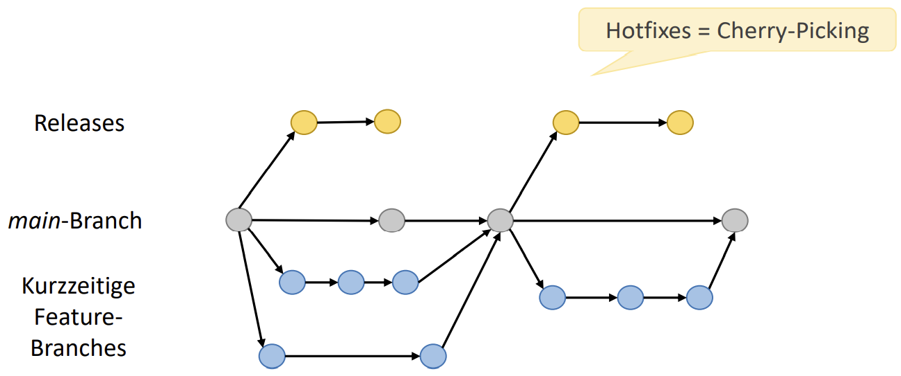

MPP2 - Themenkatalog
====================

<!-- md2apkg ignore-card -->

<!-- START doctoc generated TOC please keep comment here to allow auto update -->
<!-- DON'T EDIT THIS SECTION, INSTEAD RE-RUN doctoc TO UPDATE -->

<!-- END doctoc generated TOC please keep comment here to allow auto update -->

<!--pagebreak-->

# Präambel

Diese File beinhaltet überwiegend Inhalte der letzten beiden Semester zur Vorbereitungen für die zweite mündlichen Praxisprüfung. Es sollte stets gemeinsam mit den [Vorbereitungen zur ersten Praxisprüfung](../BASE-PACK/README.md) betrachtet werden.

Als größtenteil irrelevant betrachtete Themen:
> **ToDo**
>
> - manche WPM II und III
>   - Herbst Unity
>   - Medienkram Turtenwald
>   - **ToDO**
> - Graphische Datenverarbeitung - (GDV) - Herbst
> <!--über die folgenden müssen wir noch diskutieren-->
> - neuronale Netze und maschinelles Lernen - (ML) - Feldmann (**ToDo**)
> - Forensik - (PRO) - Strassburg (**ToDo**)
> - e-Commerce - (WEB) - Müller (**ToDo**)
> - Consulting - (CONS) - Müller (**ToDo**)
> - ABWL 1&2 - Leder (Ausnahmen)

<!-- md2apkg ignore-card -->

# Hardwarenahe Programmierung

> **ToDo**
>
> - Intel vs. AVR?
> - Application Binary Interface (ABI)
> - Register
> - Stack
> - Heap
> - Flags
> - Timer
> - Watchdog

<!-- md2apkg ignore-card -->

# Systemprogrammierung

> **ToDo**
>
> - Parallele Programmierung
> - Kritischer Abschnitt [DONE]
> - Atomare Operation
> - Exklusive Ressource
> - Fork [DONE]
> - Deadlock [DONE]
> - Semaphore [DONE]
> - Interprozesskommunikation [DONE]
>   - Pipes (uni/bidirektional, named) [DONE]
>   - Sockets (lokal, rechnerübergreifend) [DONE]
>   - Shared Memory [**ToDO**]
> - Signale?! <!-- Steht nur in der Übersicht am Anfang des Moduls und taucht dann nicht nochmal auf-->

<!-- md2apkg ignore-card -->
<!-- Deadlock -->

## Wie lautet das Philosophenproblem?

- 5 Philosophen mit 5 Stäbchen an rundem Tisch
- Aktion: Denken oder Essen;
- Essen benötigt zwei Stäbchen (Nicht genug Ressourcen für alle)
- gleichzeitiger Zugriff
- Deadlock kann entstehen

## Was ist ein Deadlock?

- **Allgemein**
  - Situation, in der sich beide Alternativen eines Dilemmas gegenseitig blockieren **oder**
  - in der die Handlungspartner nicht zu Kompromissen zur Lösung einer solchen Situation bereit sind, wodurch die Situation ausweglos wird.
- **Informatik**
  - Gegenseitige Blockade mehrere Prozesse, weil sie auf die Freigabe von Betriebsmitteln warten, die ein anderer beteiligter Prozess bereits exklusiv belegt hat

## Wie werden Deadlocks verhindert oder aufgelöst?

- ggf. auch über Pipes (Implementierung notwendig)
- Sockets benutzen
- Semaphoren
- Reboot
- Auf Ressource verzichten (Signale an Prozess senden)
- Prozess beenden, Signal SIGTERM/SIGKILL

<!-- ToDo Erklärung für Pipes, Sockets, Factcheck, sind Semaphoren gemeint?-->

<!-- Fork -->

## Zweck, Wirkweise fork()

- es wird eine exakte Kopie des Aufrufers als Kindprozess erzeugt
- Kindprozess übernimmt Code, Daten inkl. Befehlszähler, Dateideskriptoren, ...

<!-- Sempahore -->

## Rückgabewerte fork

- `>0`: die PID des Kindprozesses
- `0`: es wurde eben geforkt und wir sind das Kind
- `-1`: Fehler

<!-- Interprozesskommunikation IPC -->

## Motivation Interprozesskommunikation

- Verhinderung von
  - gleichzeitigen Schreibzugriffen
  - Verhungern von Prozessen
  - Deadlocks

### Wie können Sie bidirektionale Interprozesskommunikation ermöglichen?

- Pipe umdrehen, ggf. mit Zugriffskonzept (Semaphore), BAD Practice
- 2 Pipes verwenden
- Sockets

<!-- Semaphore -->

## Was sind Semaphoren und wozu werden Sie eingesetzt?

- Mittel der Interprozesskommunikation zu Verwaltung von (exklusivem) Zugriff auf Ressourcen
- Deadlock vermeiden

## Was ist der kritische Abschnitt im Kontext Sempahoren?

- Es ist ein Codebereich, der nur in einer definierten Anzahl von Prozessen gleichzeitig zur Verfügung steht (stehen sollte)
- Entwickler müssen im Programm dafür Sorge tragen und den kritischen Abschnitt definieren
- Semaphor Operation P, Passieren, Vor dem kritischen Abschnitt LOCK - Ressourcen blockieren
- Semaphor Operation V, Verlassen, Nach dem kritischen Abschnitt UNLOCK - Ressourcen freigeben

<!-- Pipes -->

## Was sind Pipes im Kontext Interprozesskommunikation? Unterscheiden Sie zwei Arten von Pipes

- unidirektionaler Datenstrom zwischen zwei Prozessen: Puffer/Warteschlange nach dem FIFO-Prinzip
- namenlose Pipes: Kommunikation zwischen verwandten Prozessen (vgl. fork())
- benannte Pipes: Zugriff durch alle Prozesse mit Zugriffsrecht möglich

## Welche Operationen auf einer Pipe kennen Sie? Beschreiben Sie deren Funktion

- `write(pipefd[1],buffer)`
  - Write: Aus Programmbuffer auf die Pipe schreiben, in den Kernelbuffer
  - Daten sind gepuffert bis sie gelesen werden
- `read(pipefd[0],buffer)`
  - Read: Aus Kernelbuffer in Programmbuffer schreiben; aus Sicht des Programms von Pipe lesen
  - Lesen verbraucht Daten der Pipe

<!-- Socket -->

## Addressfamilien Socket

- POSIX local inter-process communication sockets/Unix Domain Socket/IPC Socket (AF_UNIX,AF_LOCAL)
- Internet-Domain (AF_INET und AF_INET6)
- diverse andere, viele veraltet
  - AF_IRDA
  - AF_BLUETOOTH

## Arten Socket

- Verbindungslos (SOCK_DGRAM)
- vollduplex, verbindungsorientiert (SOCK_STREAM)

außerdem

- SOCK_RAW nur für Developer, Root-User, Zugriff auf L3,L2-Felder --> eigenes L4-Protokoll entwickeln
- SOCK_SEQPACKET (nur UNIX, besseres SOCK_STREAM)

## Unterschied Pipe Socket

- Pipes
  - Unix-Domaine exklusiv, d.h. gleiches Rechensystem
  - unidirektional
- Socket
  - Unix/Internetdomäne
  - bidirektional

# Entwicklung von Webanwendungen

> **ToDo**
>
> - HTML
> - CSS
>   - Selektoren
> - Javascript
> - PHP
> - REST-APIs

<!-- md2apkg ignore-card -->

# IT-Sicherheit/-Recht/-Infrastrukturen

> **ToDo**
>
> - IT-Sibe
> - ISO 27001
> - BSI 200er kennen
> - IT-Grundschutz-Kompendium und Bausteine einordnen
> - Governance vs. Compliance
> - Geltende Gesetze
> - Schutzziele
> - Personenbezogene Daten
> - Besondere Datenkategorien
> - Anonymisierung, Pseudonomisierung

<!-- md2apkg ignore-card -->

# Rechnernetze und Verteilte Systeme

> **ToDo**
>
> - Verteiltes System (Definition) [DONE]
> - CAP-Theorem [DONE]
> - Namens- und Verzeichnisdienste [DONE]
> - Caching vs. Replikation [DONE]
> - ACID vs. BASE [DONE]
> - sync. vs. async (Replikation)
> - Microservices
> - Firewalls
> - VLAN
> - OSPF
> - BGP
> - Architekturen

<!-- md2apkg ignore-card -->

## Verteiltes System (Definition)

Ein verteiltes System...

- besteht aus mehreren Einzelkomponenten auf unterschiedlichen Rechnern
- besitzt keinen gemeinsamen Speicher
- koordiniert und kooperiert mittels Nachrichtenaustausch (Netzwerk)
- hat ein gemeinsames Ziel
- tritt gegenüber Nutzenden als kohärentes System auf

## CAP-Theorem

Ein verteiltes System kann zwei der folgenden Eigenschaften gleichzeitig erfüllen, jedoch nicht alle drei:

- **C**onsistency (Konsistenz)
- **A**vailability (Verfügbarkeit)
- **P**artition Tolerance (Ausfalltoleranz)

## Namens- vs. Verzeichnisdienste (Definition)

- **Namensdienst:** Bilden Namen auf Adressen ab
  - Namen: standortunabhängige Bezeichnung einer Ressource
  - Adresse / Referenz: eindeutige, physikalische / ortsbezogene Bezeichnung
- **Verzeichnisdienst:** Finden von Kommunikationspartnern, Ressourcen, Attributen, ...
  - Erweiterung des Namensdienstes

### Caching vs. Replikation

**Caching**

- Speicherung von Teilen des Namensraums
- v.a. auf unteren Ebenen
- vollst. oder teilw. Namen
- *reaktiv*

**Replikation**

- v.a. auf unteren Ebenen
- höhere Fehlertoleranz
- *proaktiv* (geplant)

> Problem: Aktualität von Einträgen und Gewährleistung von Konsistenz

## ACID-Prinzip

> auf Konsistenz ausgelegt

- **Atomicity:** Entweder vollständige oder keine Ausführung
- **Consistency:** nur Übergänge von konsistentem Zustand zu konsistentem Zustand
- **Isolation:** keine Überlappung von Transaktionen, die sich gegenseitig beeinflussen können
- **Durability:** nach Abschluss einer Transaktion werden Daten garantiert dauerhaft in einer DB gespeichert

### ACID vs. BASE

> **BASE** = **B**asically **A**vailable, **S**oft state, **E**ventual consistency (BASE)

|                      | ACID                         | BASE                                             |
| -------------------- | ---------------------------- | ------------------------------------------------ |
| **Optimierungsziel** | Konsistenz                   | Verfügbarkeit (Konsistenz wird nicht garantiert) |
| **Zugriffe**         | isoliert (Commit-basiert)    | letzer Schreibzugriff "gewinnt"                  |
| **Implementation**   | komplex, begrenzt skalierbar | einfach implementier und skalierbar              |
| **Attribute**        | konservativ / pessimistisch  | aggressiv / optimistisch / best effort           |

# Allgemeine Betriebswirtschaftslehre

> **ToDo**
>
> - Kalkulation <!--Günther-->
>   - Break-Even-Analyse
>   - Teil- vs. Vollkostenrechnung
>   - statische Amortisationsrechnung [DONE]
> - Angebotsarbeit <!--Günther-->
> - Unternehmen/Betrieb/Firma (Defintionen) [DONE]
> - Rechtsformen (Überblick)
> - Produkt-/Preis-/Kommunikations-/Distributions-Politik <!--?-->
> - SWOT <!--?-->
> - Projekt (Definition, Phasen)
> - Klassische Qualitätssicherung vs. TQM <!--?-->
<!-- Kompetenz !!!-->

<!-- md2apkg ignore-card -->

## Unternehmen / Betrieb / Firma

- **Unternehmen:** ganzheitliche, rechtliche, finanzielle und wirtschaftliche Einheit des Betriebs
- **Betrieb:** Ort der Leistungserbringung
- **Firma:** Geschäftsbezeichnung eines Unternehmens inkl. Rechtsformzusatz

## BWL-Kalkulation

### Statische Amortisationsrechnung

> Berechnung der Zeitspanne bis zur vollständigen Tilgung einer Investition

$$\text{Amortisationszeit} = \frac{\text{Kapitaleinsatz}}{\text{Rückflüsse pro Jahr}}$$

# Entwicklerwerkzeuge

> **ToDo**
>
> - Dokumentationsgeneratoren (Vorteile) [DONE]
> - Builds-Tools (Make) [DONE]
> - Versionsverwaltung [DONE]
> - Debugger (Arten) [DONE]
> - Speicherzugriffsanalyse (statisch/dynamisch) [DONE]
> - Profiling [DONE]
> - Unit-Tests [DONE]

<!-- md2apkg ignore-card -->

## Dokumentation

- Unterscheidung zw. **interner Doku (Entwickler-/Tester-Doku)** und **externer Doku (Endnutzer)**
- interne Doku wird durch Entwickler geschrieben und **direkt im Quellcode** festgehalten
  - **einfache Änderung**
  - direkte Einbindung in **Versionsverwaltung**
  - Unterstützung durch **IDE-Anbindung**
- Formate: `LaTeX`, `Docbook`, `AsciiDoc`, `Markdown`

### Dokumentationsgeneratoren

- Zweck: Erzeugung kommentierter Klassenreferenzen
- Extraktion der Doku aus dem Code und **speziellen Kommentaren im Source**
- *Spezielle Formatierung* von Funktionsparametern- und Returnwert-Doku
- Automatische Erzeugung von *Listen und Inhaltsverzeichnissen,* Abhängigkeitslisten, ...
- Beispiele: `doxygen`, `javadoc`, `robodoc`, ...

```cpp
/// this function does something
int someFunction(int par1, ///< parameter 1
                 int par2) ///< parameter 2
```

## Versionsverwaltung

- **Verwaltung und Archivierung aller Dateien** eines Software-Produkts **in Ständen**
- Buchführung über jede einzelne Änderung in jeder einzelnen Datei
  - optimierte Speicherung: **Nur die Deltas jeder Änderung,** nicht jedesmal die komplette Datei, und zwar **rückwärts** (aktuelle Version im Volltext)

> **Reproduzierbarkeit und Nachverfolgbarkeit**

## Builds-Tools (`make`)

- `make` automatisiert das **Kompilieren (großer) Projekte**
- erzeugt **intern Abhängigkeitsgraphen** der gewünschten Output-Files von den dazu notwendigen Input-Files
- baut nur genau das neu, was notwendig ist/geändert wurde
- `make` **arbeitet nur nach File-Datum** (greift nicht auf die File-Inhalte zu)
- erkennt Abhängigkeiten der Files $\rightarrow$ kann voneinander **Unabhängige parallel kompilieren**
- Konfiguration über `Makefile` $\rightarrow$ Targets und deren Abhängigkeiten

## Debugger

> Werkzeug zum **Diagnostizieren und Auffinden von Fehlern**

- Code muss mit **Debug-Symbolen** kompiliert worden sein
- Ansichten: Position im Source, Call-Stack (Funktionen + Argumente), Variablen (lokal + global)
- Funktionen: Breakpoints, Stepping, Watchpoints, Manipulation von Variablen, ...

### Betriebsmodi eines Debuggers

- **Post-mortem** Debugging: Analysieren einer "Leiche" (`core dump` laden)
- Anhängen an einen **bereits laufenden Prozess:** nützlich, wenn Programm erst nach langer Laufzeit Fehler zeigt
- **Starten einer Binary** mit Debugger: gängigste Methode in der Entwicklung

### Speicherfehler

- **Memory-Leaks:** Referenz auf dynamisch reservierten Speicher geht verloren $\rightarrow$ Speicherbedarf wächst bis zum Prozessabbruch
- **Memory-Fragmentation:** kein echter Programmfehler $\rightarrow$ ungünstige Speichernutzung
  - Folge unterschiedlich großer `malloc` und `free` Befehle $\rightarrow$ keine größeren Speicherblöcke mehr verfügbar

#### Speicherfehler-Tools

- **Adress Sanitizer:** über jedes Byte im gesamten Adressraum wird Buch geführt ob (un)gültig; jeder Pointerzugriff wird geprüft
- **Memory Sanitizer:** erkennt Lesezugriffe auf Speicherbereiche, die zuvor nicht initialisiert wurden
- **Leak Sanitizer:** liefert am Ende der Ausführung Liste dynamisch angelegter und nicht freigegebener Speicherstrukturen
- **Thread-Sanitizer:** erkennt Data Races (Zugriffe verschiedener Threads auf gemeinsamen Speicher $\rightarrow$ zufällig, Scheduler abhängig!)

## Profiling

> Untersuchung des zeitlichen Programmverhaltens

- Statistiken zu:
  - Anzahl der Funktionsaufrufe
  - Ausführungszeit von Codeabschnitten
  - Coverage (*Welcher `if`-Zweig nie/selten?*)
- **Instrumentierte Profiler:** Messcode für Code-Blöcke und Funktionen $\rightarrow$ exakte Messung, verändertes Zeitverhalten durch Overhead
- **Sampling Profiler:** *Code bleibt unverändert* $\rightarrow$ regelmäßiges Unterbrechen und Extrahieren von Debug-Infos (aber an manchen Stellen "blind")

### Ziele von Profiling

- **Hotspots** erkennen (stark frequentierte bzw. zeitintensive Codeblöcke) $\rightarrow$ größtes Potential für Optimierung
- **Feedback** für Optimierungen
- Abdeckungsgrad von Tests feststellen

## Unit Tests

> Tests von möglichst kleine Code-Stücken (z.B. Funktionen) auf konformes Verhalten

- Motivation: zeitnahe Fehlerfindung, gesamte Code-Abdeckung, genaue Lokalisierung
- laufen automatisch, erfordern Tooling
- hoher Einmal-Aufwand, geringer laufender Aufwand
- Positive Nebeneffekte: Prüfung der Spezifikation und des Feinentwurfes
- Ein Testfall pro Verhalten einer Funktion $\rightarrow$ ein Testfall pro Codefall
- Ein Testfall für jeden bekannten Bug
- Erstellung zeitnah/gleichzeitig zum Code (nicht durch QA $\rightarrow$ Betriebsblindheit)
- werden in der Versionsverwaltung mit eingecheckt

# Compilerbau

> **ToDo**
>
> - Lexer [DONE]
> - Parser [DONE]
>   - Top-Down-Parser
>   - Shift-Reduce-Parser
> - Compiler-Compiler

<!-- md2apkg ignore-card -->

## Lexer

> *"lexikalischer Analysator"*

- Verarbeitet Strom von Einagbezeichen in Token
- z.B. Zusammenfassen von Ziffer zu Zahlen oder Buchstaben zu Schlüsselworten

## Parser

> *"Syntaxanalysator"*

- Anwendung der Syntaxregeln zur Verarbeitung der Eingabe
- Ausgabe: Syntaxbaum oder direkte Ausführung
- Erkennung von Syntaxfehlern

# Computerforensik

> **ToDo**
>
> - Definition: Digitale Forensik
> - Datenschutzvorfall
> - Bereiche
> - Spuren
> - Post-Morem vs. Live-Forensik

<!-- md2apkg ignore-card -->

# IT-Consulting

> **ToDo**
>
> - DevOps
> - Virtualiserung vs. Containerisierung

## DevOps

- Kofferwort aus "Development" und "Operations"
- bezeichnet Entwicklung und Betrieb einer Software durch dasselbe Team, untrennbar
  - im ferneren Sinne auch QA
- oft in Verbindung mit Lean Management, agilen Methoden und CI/CD

### Ein paar Bestandteile der Entwicklung

- Programmieren der Software
- Tests
- Artefakte erzeugen (Kompilate / Archive)
- Auslieferung
- Doku für Kunde

### Ein paar Bestandteile des Betriebs (Ops)

- Bereitstellung der Hardware
- Installation der Software und Abhängigkeiten
- Monitoring
- Updates
- Wartung der Komponenten (z.B. pflegen der Datenbank)

### Vorteile von DevOps

- keine _Wall of Confusion_ / Silodenken zwischen Teams
- beschleunigt Entwicklungsprozess
- verhindert _"works on my machine"_

### Methode: Infra as Code (IaC)

- Infrastruktur wird maschinenlesbar abgebildet
- Nutzung von Auszeichnungssprachen (JSON, YAML)
- versionierbar
- hoher Automatisierungsgrad
- Bsp.: Ansible, Terraform, Chef, Puppet

### Blue/Green Deployment

- Minimierung der Ausfallzeit bei Updates
- zwei Instanzen einer Anwendung hinter Reverse Proxy, laufen parallel
- produktiv schalten der neuen Version durch Änderung der Reverse Proxy Konfiguration $\rightarrow$ minimale Downtime

### A/B Testing

- testen experimenteller Änderungen an kleinem Prozentsatz von Nutzern
- messen der Hypothesen, Vergleich der Reaktionen zwischen den Varianten

### Canary Releases

- ähnlich zu A/B, aber mit dem Zweck, Fehler in neuen Versionen zu finden
- alte und neue Instanz laufen hinter Reverse Proxy, kleiner Prozentsatz Nutzer wird auf neue, zu testende Version der Anwendung geleitet

## Vorteile von Monolithen

- einfaches Modell für Entwickler
- einheitliche Code-Basis und Build-Umgebung
- einfache **vertikale** Skalierbarkeit, d.h. mehr Ressourcen für Instanz zuweisen

## Nachteile von Monolithen

- Code-Basis wird riesig und unüberschaubar
- Überlastete Tools bei Refactoring, Builds, ...
- Skalierung ist Ressourcen-intensiv
- Deployment erfordert Stopp des gesamten Systems
- **horizontale** Skalierbarkeit schwierig

## Vorteile von Schichten-Architekturen

- einfach hinsichtlich Abhängigkeiten, Deployment, Skalierungsmodell

## Nachteile von Schichten-Architekturen

- Codebasis wächst mit jeder Schicht
  - und damit auch die Entwicklungs- / Betriebs-Prozesse
- Skalierung besser, aber weiterhin begrenzt
- technische Zerlegung $\rightarrow$ Silodenken

## REST

> Definition?

<!-- md2apkg split -->

- **Re**presentational **S**tate **T**ransfer
- Maschine-zu-Maschine Kommunikation auf Basis von HTTP als weit verbreitetes und gut unterstütztes Datenübertragungsprotokoll
- Client-Server-Prinzip
- zustandslos
- Caching möglich
- Nachrichten sind selbstbeschreibend, da Ressourcen über URI adressiert
- unterstützt verschiedene Repräsentationen für Daten, z.B. JSON, XML

### CRUD-Operatoren

- was bedeutet CRUD?
- was sind die Operatoren?

<!-- md2apkg split -->

- Create, Read, Update, Delete
- POST, GET, PUT, DELETE

## Microservice-Architektur

> Skizzieren Sie eine Microservice-Architektur und erläutern sie diese

<!-- md2apkg split -->

<!--width=600px-->

- erledigt nur eine Aufgabe, siehe UNIX-Philosophie
- arbeitet mit anderen Microservices via universeller Schnittstelle (z.B. REST)
- $\rightarrow$ Modularisierung (fachlich), funktionieren unabhängig voneinander
- keine gemeinsamen Zustände
- Vorschlag: Ein MS durch 5 bis 7 Entwickler realisierbar
- Betrieb in VMs oder Containern

### Vorteile von Microservices

- getrennte, überschaubare Code-Basen
- schnellere Entwicklung, CI/CD mit kürzeren Durchlaufzeiten
- geringe Kopplung
- Erweiterbarkeit durch einheitliche Schnittstellen
- horizontal und vertikal skalierbar
- Updates im laufenden Betrieb möglich

### Nachteile von Microservices

- empfindlich gegenüber Netzwerk-Störungen
- komplizierteres Modell
- höherer Overhead (Rechenressourcen und Kommunikation via HTTP)
- Datenkonsistenz wird aufwändiger
- Logging, Monitoring und Testen wird aufwändiger

## Versionsverwaltung

Was ist der *Zweck* / die Motivation von Versionsverwaltung?

<!-- md2apkg split -->

- organisiert Entwicklungszustände
- Archivieren und Wiederherstellung alter Zustände
- protokolliert Änderungen
- gemeinsamer Zugriff wird koordiniert

...das ist mit einfachen Lösungen wie File-Shares nicht möglich.

### Git: Datei-Lebenszyklus

- **Untracked**: nicht eingecheckt
- **Unmodified**: eingecheckt, keine lokale Änderung
- **Modified**: eingecheckt, lokale Änderung
- **Staged**: modifizierte Datei ist in Änderungsmenge, diese Version ist zum Commit vorgemerkt (Änderungen nach Stage werden nicht committet)
- **Committed**: Datei-Version ist permanent in lokalem Repository
- **Pushed**: Version an externes Repository übertragen

### Git: Merge vs. Rebase

- **`git merge`**: Commits aus einer Branch in eine andere Branch übernehmen, die Änderungen _verschmelzen_
- **`git merge`**: schreibt einer Branch um, sodass sie auf einen neuen Commit der Parent Branch zeigen
  - Effekt: neue Änderungen an der Eltern-Branch werden in Child-Branch übernommen
  - Remember: Commits sind Rückwärts-Deltas

### Git: Feature-getriebener Workflow (Bild)

<!--width=600px-->

### Git: Trunk-basierter Workflow (Bild)

<!--width=600px-->

### Git: Vor- und Nachteile Feature-Workflow

| Vorteile | Nachteile |
| :------: | :-------: |
| Verwaltung großer Projekte einfacher, da sauberer Zustand einzelner Branches | viele Merges notwendig, unübersichtlich |
| Trennung von stabilem und experimentellem Code, leichter Einstieg | langlebige Feature-Branches lassen Versionen divergieren |
| Unterstützung für Release-Planung und verschiedenen Release-Zweigen | parallele Branches erschweren DevOps |

### Git: Vor- und Nachteile Trunk-Workflow

| Vorteile | Nachteile |
| :------: | :-------: |
| Nur Main-Branch ist langlebig $\rightarrow$ weniger Merge-Konflikte | Main-Branch unterliegt ständiger Änderung (Churn) |
| Einfachs Branching-Modell, vermeidet divergierende Entwicklung | Parallele Feature-Entwicklung in einer Branch |
| Schnelle Entwicklungszyklen, da einfache Integration und jederzeit lauffähige Version | Gemeinsame Verwaltung von stabilem und experimentellem Code, da sofortiges Zusammenlaufen in `main` |


<!-- md2apkg ignore-card -->

# Wissenschaftliches Arbeiten

> **ToDo**
>
> - Problemdefinition <!--Günther-->
> - Lösungsansatz <!--Günther-->
> - Anforderungsanalyse [DONE]

## Anforderungsanalyse

- Erhebung, Analyse, Spezifikation und Bewertung von Anforderungen eines Auftraggebers (nach IEEE)
- Ergebnis der Analyse: Lastenheft oder Backlog

### Nicht-Funktionale Anforderungen

> Anforderungen an die Qualität und Anforderungen, die sich aus Randbedingungen ergeben.

- **Qualität (nach ISO / IEC 9126):**
  - Änderbarkeit
  - Benutzbarkeit
  - Effizienz
  - Funktionalität
  - Übertragbarkeit
  - Zuverlässigkeit
- **Randbedingungen:**
  - Gesetze
  - Normen
  - Organisatorisch (Standards, Vorgehensweisen, Termine, Kosten)

### Funktionale Anforderungen

> beschreiben die Funktionalitäten und das Verhalten des Produkts ($\rightarrow$ Produktspezifisch)

<!-- md2apkg ignore-card -->
